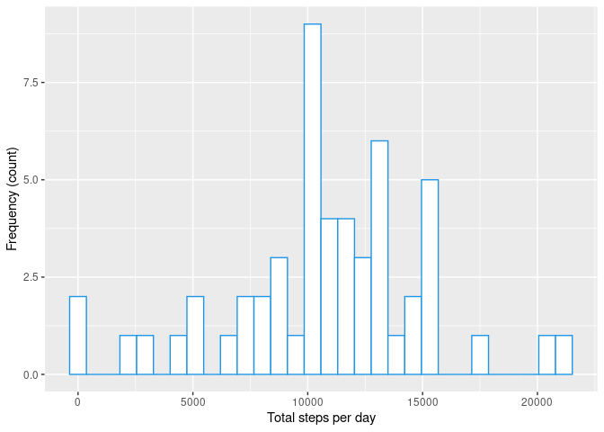
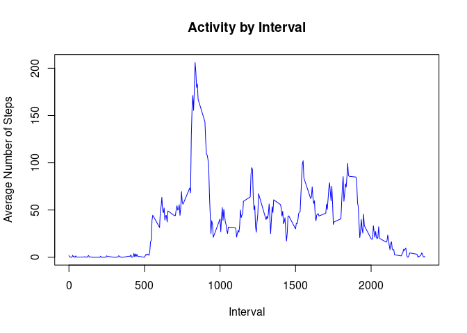
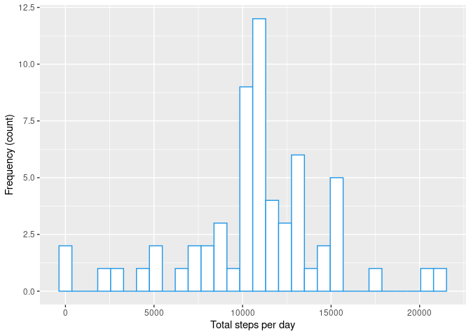
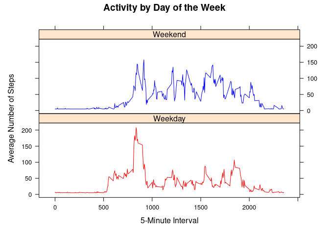

## **Loading and preprocessing the data**

Unzip and load data

```r
unzip(zipfile = 'activity.zip')
activ_data <- read.csv('activity.csv')
```

Process and transform data

```r
#format date var
activ_data$date <- as.POSIXct(activ_data$date, format = '%Y-%m-%d')
```

Create new data frame grouped by total steps per day

```r
total_steps <- group_by(activ_data[complete.cases(activ_data),], date) %>% summarise(total_steps = sum(steps, na.rm = TRUE))
```

Create histogram of the total number of steps taken each day
<!-- -->

## **What is mean total number of steps taken per day?**

```r
cat(bold('The mean total steps per day is:', mean(total_steps$total_steps)))
```

```
## The mean total steps per day is: 10766.1886792453
```

```r
cat(bold('The median total steps per day is:', median(total_steps$total_steps)))
```

```
## The median total steps per day is: 10765
```

## **What is the average daily activity pattern?**
Create new data set

```r
ts_data <- group_by(activ_data, interval) %>% 
   summarise(mean_steps = mean(steps, na.rm = T))
```

Plot the data
<!-- -->

Calculate a 5-minute interval that, on average, contains the maximum number of steps

```r
max_interval <- ts_data[which.max(ts_data$mean_steps),1]
max_interval <- unlist(max_interval);
cat("5-min interval with the maximum number of steps:", max_interval)
```

```
## 5-min interval with the maximum number of steps: 835
```

## **Imputing missing values**

Calculate and report the total number of missing values in the dataset 

```r
cat('Number of NAs in steps:', sum(is.na(activ_data$steps)))
```

```
## Number of NAs in steps: 2304
```

```r
cat('Number of NAs in date:', sum(is.na(activ_data$date)))
```

```
## Number of NAs in date: 0
```

```r
cat('Number of NA in inteval:', sum(is.na(activ_data$interval)))
```

```
## Number of NA in inteval: 0
```

The strategy used to account for missing data was to impute the mean for any NA.


```r
activ_data$steps[is.na(activ_data$steps)] <- mean(activ_data$steps, na.rm = T)  
cat('Number of NA in steps post imputation:', sum(is.na(activ_data$steps)))
```

```
## Number of NA in steps post imputation: 0
```

Create histogram of the total number of steps taken each day after missing values are imputed


```r
new_total_steps <- group_by(activ_data[complete.cases(activ_data),], date) %>% summarise(total_steps = sum(steps, na.rm = TRUE))
```

Plot the data
<!-- -->

## **Are there differences in activity patterns between weekdays and weekends?**

Create new variable with two levels: weekday and weekend

```r
activ_data$date <- as.Date(activ_data$date)
activ_data$weekday <- weekdays(activ_data$date)
activ_data$weekday = ifelse(activ_data$weekday %in% c('Sunday', 'Saturday'), 'Weekend', 'Weekday')
```

Create new data frame grouped by total steps per day

```r
new_ts_data <- activ_data %>% group_by(weekday, interval) %>% 
   summarise(mean_steps = mean(steps))
```

```
## `summarise()` has grouped output by 'weekday'. You can override using the
## `.groups` argument.
```

Plot data
<!-- -->


```r
wk_grp_mean <- new_ts_data %>% group_by(new_ts_data$weekday) %>% summarise(across(mean_steps, mean, na.rm = TRUE))

cat(bold('Activity Patterns for Weekends are higher than Weekdays.'))
```

```
## Activity Patterns for Weekends are higher than Weekdays.
```

```r
cat(bold('The mean total steps for weekdays is:', unlist(wk_grp_mean[1,2])))
```

```
## The mean total steps for weekdays is: 35.6105811786629
```

```r
cat(bold('The mean total steps for weekend is:', unlist(wk_grp_mean[2,2])))
```

```
## The mean total steps for weekend is: 42.366401336478
```
